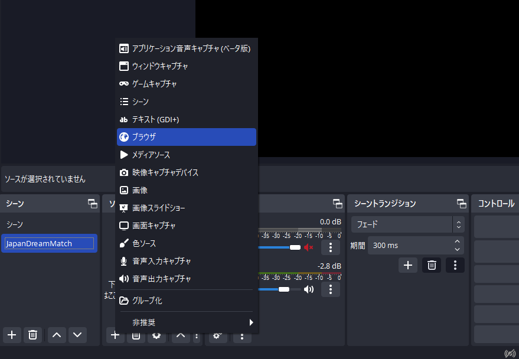
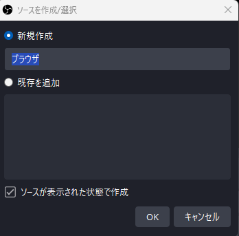
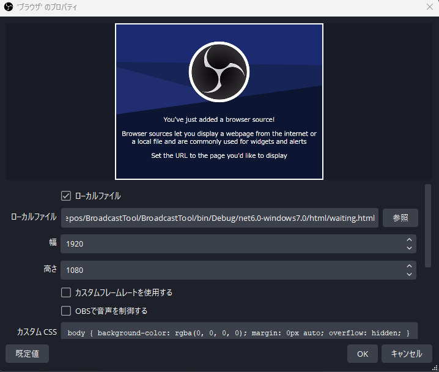
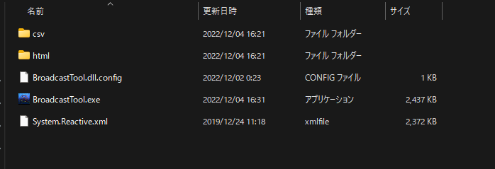
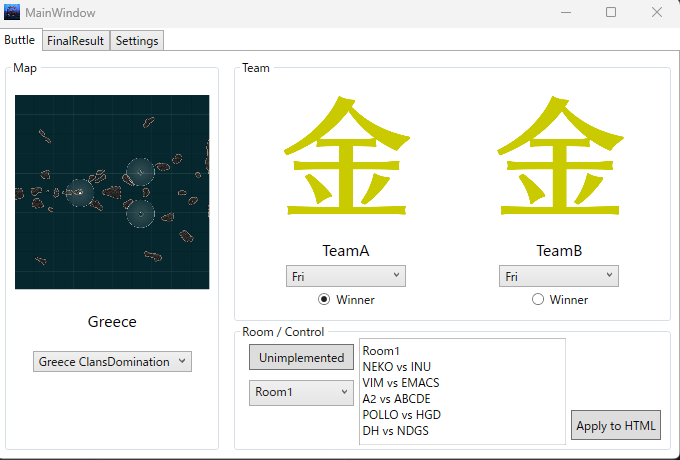

<span style="font-size: 36px">JapanDreamMatch/BroadcastToolの使い方</span>
> ## 前提
> - OBSはインストール済みのものとします
> - この説明はBroadcastTool v0.1.0(α)のものです

# OBSの設定
## 1. ソースの作成
- OBSにてブラウザソースを作成します
  

- 任意の名前を設定します  
  

- プロパティ画面で __**「必ず最初に」**__ 以下の設定をします
  - ローカルファイルにチェックを入れる
  - ローカルファイルを後述のダウンロードしたHTMLファイルを選択(下記のどれかとなります)
    - final_result.html
    - game.html
    - waiting.html
    - winner.html
  - 幅:高さを下記の数字のいずれかを記入 (画像では1080p=1920:1080の例)
    - 1280 : 720
    - 1920 : 1080
    - 3840 : 2160


- 「OK」を押します

> ## 注意  
> OBSでは、下記の解像度のみでの配信が可能です
> - 720p
> - 1080p
> - 4K
>  
> 参考：480p等の解像度でもおそらくは可能ですが、1600x900等16:9であっても使用が難しい場合があります.

## 2. 変更の適用
OBSでは、htmlファイルが書き変わっても自動で画面が変わりません.  
そのため、`BroadcastTool.exe`似て書き換えた後は「再読み込み」ボタンを押して変更を適用してください.  


---
<span style="font-size: 36px">BroadcastTool.exeの使い方</span>

# 1. ダウンロード
- [BroadcastTool Releases](https://github.com/JapanDreamMatch/BroadcastTool/releases)から`BroadcastTool v0.1.0 Alpha.zip`をダウンロードします
- ダウンロードした`BroadcastTool v0.1.0 Alpha.zip`を任意の場所に展開します
  - 内容物は以下のようになっています  
  

> ### Note
> 特にインストールなどの必要はありません. スタンドアローンで動きます.

# 2. 起動
`BroadcastTool.exe`(拡張子表示なしの場合は`BroadcastTool`)をダブルクリックで起動  
起動画面は以下のようになります


> ### Note  
> - csvフォルダ、htmlフォルダとその中身が正常に存在しない場合起動しません.  
> - Runtimeが必要と言われた場合は.NET 6.0を動かすRuntimeを[Microsoftのページ](https://learn.microsoft.com/ja-jp/dotnet/core/install/windows?tabs=net70)からインストールしてください


# 3. 操作
## 3.1 Buttle Tab
ButtleTabでは下記3つのHTMLファイルを書き換えることができます  
- waiting.html
  - Map
  - 対戦するチーム
  - 部屋の対戦表
- game.html
  - 対戦するチーム
- winner.html
  - 勝利したチーム名とチームロゴ
  - 対戦するチーム
  - 部屋の対戦表

`Apply to HTML`ボタンを押した場合、3つのHTMLファイルすべてが書き変わります

## 3.2 Final Result Tab
FinalResultでは下記のHTMLファイルを書き換えることができます
- final_result.html
  - 1st Placeのチーム名とチームロゴ
  - 2nd Placeのチーム名とチームロゴ
  - 3rd Placeのチーム名とチームロゴ

`Apply to HTML`ボタンを押した場合、`final_result.htmlが書き変わります`

## 3.3 Settings Tab
Settings Tabでは下記の2つを行うことができます
- Buttle TabのMap名の言語選択
- BroadcastToolのバージョン確認


---
<span style="font-size: 36px">[Advanced] ファイルの追加</span>  
ダウンロードしたフォルダにある「html」フォルダと「csv」フォルダの中身を追加、変更することで`BroadcastTool.exe`に読み込ませることが可能です.  
その際は`BroadcastTool.exe`の再起動が必要になります.

# I. Mapの追加
## 場所
`BroadcastTool_root/html/maps/` の中にMapの画像があります.  
以下の命名規則で追加すれば、`BroadcastTool.exe`内のドロップダウンに自動で読み込まれます.  

## 命名規則
```
マップ英名_ゲームルール.拡張子

例：Greece_ClansDomination.jpg
```
### マップ英名
スペースなしのマップ英名です.  
これは`BroadcastTool_root/csv/MapList.csv`の一番左の列に列挙されています.  
名前を間違えた場合、正しく翻訳されません.  

### ゲームルール
ゲームルールです.  
実装予定のものは以下のどれかになります.  
- ClansDomination
- Domination
- TournamentDomination
- RankedButtleDomination
- StandardButtle

### 拡張子
拡張子は以下のもののみが読み込まれます.  
- jpg
- jpeg
- png

# II. チームロゴの追加
`BroadcastTool_root/html/team_icon/` の中にチームロゴの画像があります.  
以下の命名規則で追加すれば、`BroadcastTool.exe`内のドロップダウンに自動で読み込まれます. 

## 命名規則
```
チーム名.拡張子

例：JDM.jpg
```
### チーム名
チーム名です.  
この名前は`BroadcastTool_root/csv/Rooms.csv`の中の名前と合わせないとHTMLの画面上で矛盾が生まれます.  
プログラムやHTMLファイル自体に自体に影響はありません

### 拡張子
拡張子は以下のもののみが読み込まれます.  
- jpg
- jpeg
- png
